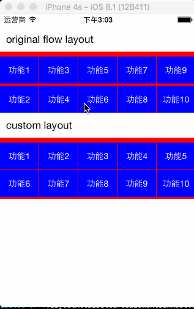

# KSTCollectionViewPageHorizontalLayout
A custom UICollectionView layout to make UICollectionView horizontal scroll, horizontal layout

## Demo
 

## Compatibility
* ARC required
* Supported build target - iOS 10.0 / Mac OS 10.12 (Xcode 8.0, Apple LLVM compiler 8.0)
* Earliest supported deployment target - iOS 6.0 (But only test in iOS 8+)

## Usage
1. Just download the KSTCollectionViewPageHorizontalLayout class files(in [KSTCollectionViewPageHorizontalLayout](KSTCollectionViewPageHorizontalLayout) directory) and drag them into your project
2. make your collection view use the layout, e.g:
```objectivec
CGRect collectionViewFrame = CGRectMake(0, 64, self.view.bounds.size.width, 100);
KSTCollectionViewPageHorizontalLayout *pageHorizontalLayout = [[KSTCollectionViewPageHorizontalLayout alloc] init];
pageHorizontalLayout.itemSize = CGSizeMake(collectionViewFrame.size.width / 5 - 1, 44);
pageHorizontalLayout.lineSpacing = 1;
pageHorizontalLayout.interitemSpacing = 1;
pageHorizontalLayout.sectionInsetTop = 8;

UICollectionView *collectionView = [[UICollectionView alloc] initWithFrame:collectionViewFrame collectionViewLayout:pageHorizontalLayout];
collectionView.delegate = self;
collectionView.dataSource = self;
[self.view addSubview:collectionView];

......
```

## Properties
	@property (nonatomic, assign) CGFloat lineSpacing;
item line spacing

	@property (nonatomic, assign) CGFloat interitemSpacing;
the space between items

	@property (nonatomic, assign) CGSize itemSize;
the layout require a fixed item size, then the layout will auto calculate lines and columns base on collection view's frame

	@property (nonatomic, assign) CGFloat sectionInsetTop;
margin top of the collection view content
